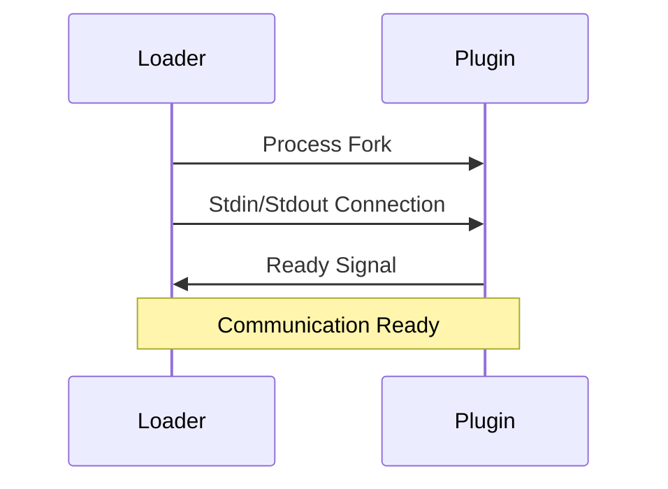
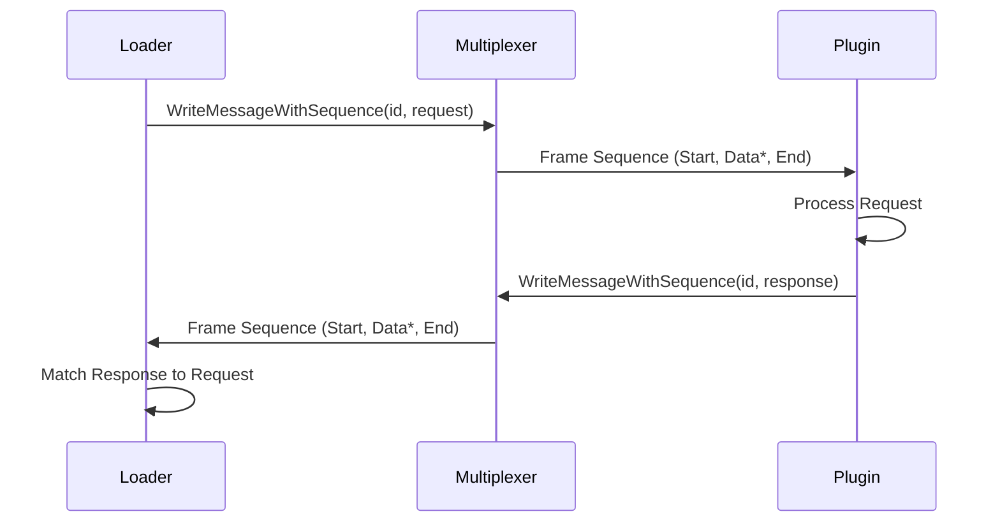

# Plugin.go Communication Protocol Documentation

## Overview

This document defines the communication protocol between the Host Application (Loader) and Plugin Process (Module) in the plugin.go project. Communication occurs through stdin/stdout, using a multiplexer to frame messages and support concurrent request/response cycles.

## Architecture Components

### 1. Loader (Host Application)
- Plugin process lifecycle management
- Request transmission through multiplexer
- Response reception and matching

### 2. Module (Plugin Process)
- Incoming request reception and processing
- Request routing to registered handlers
- Response generation and transmission

### 3. Multiplexer
- Message framing and sequence management
- Concurrent request/response support
- stdin/stdout-based bidirectional communication

## Multiplexer Message Structure

### Message Header (9 bytes)

| Field | Size | Description |
|-------|------|-------------|
| Message Type | 1 byte | Message type identifier |
| Frame ID | 4 bytes | Message sequence identifier (BigEndian uint32) |
| Data Length | 4 bytes | Payload length (BigEndian uint32) |

### Message Types

```go
const (
    MessageHeaderTypeStart    = 0x01  // New message sequence start
    MessageHeaderTypeEnd      = 0x02  // Message sequence termination
    MessageHeaderTypeData     = 0x03  // Message data chunk
    MessageHeaderTypeError    = 0x04  // Multiplexer internal error
    MessageHeaderTypeComplete = 0x05  // Complete message assembly finished
    MessageHeaderTypeAbort    = 0x06  // Message sequence abort
)
```

### Payload Structure

Message payload is composed as follows:

1. **Application Header (plugin.Header)**
2. **User Data** (actual request/response data)

## Plugin Header Structure

### Binary Format

```go
type MessageType uint8

const (
    MessageTypeRequest    MessageType = 0x01 // Request message (expects response)
    MessageTypeResponse   MessageType = 0x02 // Response message (response to request)
    MessageTypeNotify     MessageType = 0x03 // Notification message (no response expected)
    MessageTypeAck        MessageType = 0x04 // Acknowledgment message
    MessageTypeError      MessageType = 0x05 // Error message
)

type Header struct {
    Name        string      // Service name
    IsError     bool        // Error flag
    MessageType MessageType // Message type (Request/Response/Notify/Ack/Error)
    Payload     []byte      // Actual data payload
}
```

### Serialization Format

| Field | Size | Description |
|-------|------|-------------|
| Name Length | 4 bytes | Service name length (BigEndian uint32) |
| Name | Variable | Service name (UTF-8 string) |
| IsError | 1 byte | Error flag (0=success, 1=error) |
| MessageType | 1 byte | Message type (0x01=Request, 0x02=Response, 0x03=Notify, 0x04=Ack, 0x05=Error) |
| Payload Length | 4 bytes | Payload length (BigEndian uint32) |
| Payload | Variable | Actual data |

## Communication Flow

### 1. Initialization Process



#### Ready Signal
```go
Header{
    Name:    "ready",
    IsError: false,
    Payload: []byte("ready"),
}
```

### 2. Request/Response Cycle



### 3. Message Framing Example

**Request Transmission:**
```
Frame 1: [Type=Start, ID=123, Length=0] + []
Frame 2: [Type=Data, ID=123, Length=X] + [Header + UserData chunk1]
Frame 3: [Type=Data, ID=123, Length=Y] + [UserData chunk2]
Frame N: [Type=End, ID=123, Length=0] + []
```

## Special Message Types

### 1. Shutdown Related Messages

#### Graceful Shutdown
```go
// Loader -> Plugin
Header{
    Name:    "shutdown",
    IsError: false,
    Payload: []byte("graceful shutdown request"),
}

// Plugin -> Loader (response)
Header{
    Name:    "shutdown_ack",
    IsError: false,
    Payload: []byte("graceful shutdown started, waiting for jobs to complete"),
}
```

#### Force Shutdown
```go
// Loader -> Plugin
Header{
    Name:    "force_shutdown",
    IsError: false,
    Payload: []byte("force shutdown request"),
}

// Plugin -> Loader (response)
Header{
    Name:    "force_shutdown_ack",
    IsError: false,
    Payload: []byte("force shutting down"),
}
```

### 2. Ready Request Message

```go
// Loader -> Plugin
Header{
    Name:    "request_ready",
    IsError: false,
    Payload: []byte("please send ready signal"),
}

// Plugin -> Loader (response)
Header{
    Name:    "request_ready_ack",
    IsError: false,
    Payload: []byte("ready signal sent in response to request"),
}
```

## Error Handling

### 1. Transport Errors
- Pipe disconnection, process termination, etc.
- Handled by Multiplexer as MessageHeaderTypeError

### 2. Protocol Errors
- Invalid header format
- Unknown Frame ID
- Message size exceeded

### 3. Application Errors
```go
// Error response example
Header{
    Name:    "service_name",
    IsError: true,
    Payload: []byte("error message"),
}
```

## Serialization Adapters

### JSON Adapter
```go
// Request serialization
func MarshalRequest(req RequestType) ([]byte, error) {
    return json.Marshal(req)
}

// Response deserialization
func UnmarshalResponse(data []byte) (ResponseType, error) {
    var resp ResponseType
    err := json.Unmarshal(data, &resp)
    return resp, err
}
```

### Protobuf Adapter
```go
// Request serialization
func MarshalRequest(req proto.Message) ([]byte, error) {
    return proto.Marshal(req)
}

// Response deserialization
func UnmarshalResponse(data []byte, factory func() ResponseType) (ResponseType, error) {
    instance := factory()
    err := proto.Unmarshal(data, instance)
    return instance, err
}
```

## Performance Considerations

### 1. Message Chunking
- Large messages are split into multiple Data frames
- Default chunk size: 1024 bytes
- Maximum message size: 10MB

### 2. Concurrency
- Multiplexing through Frame ID
- ID management for request/response matching
- Goroutine-based asynchronous processing

### 3. Memory Management
- Read buffer pooling
- Incremental message assembly
- Maximum message size limits

## Security Considerations

### 1. Resource Limits
- Maximum message size (10MB)
- Concurrent request count limits
- Timeout settings

### 2. Input Validation
- Header field validation
- Payload size verification
- Only known service names allowed

## Extensibility

### 1. Adding New Serialization Formats
1. Implement Serializer interface
2. Provide MarshalRequest/UnmarshalResponse functions
3. Use in LoaderAdapter/HandlerAdapter

### 2. Adding New Message Types
1. Define message type constants
2. Add processing logic in Multiplexer
3. Implement handling in upper layers

This protocol documentation comprehensively covers all communication aspects of the plugin.go system, providing detailed information for developers to understand and extend the system.