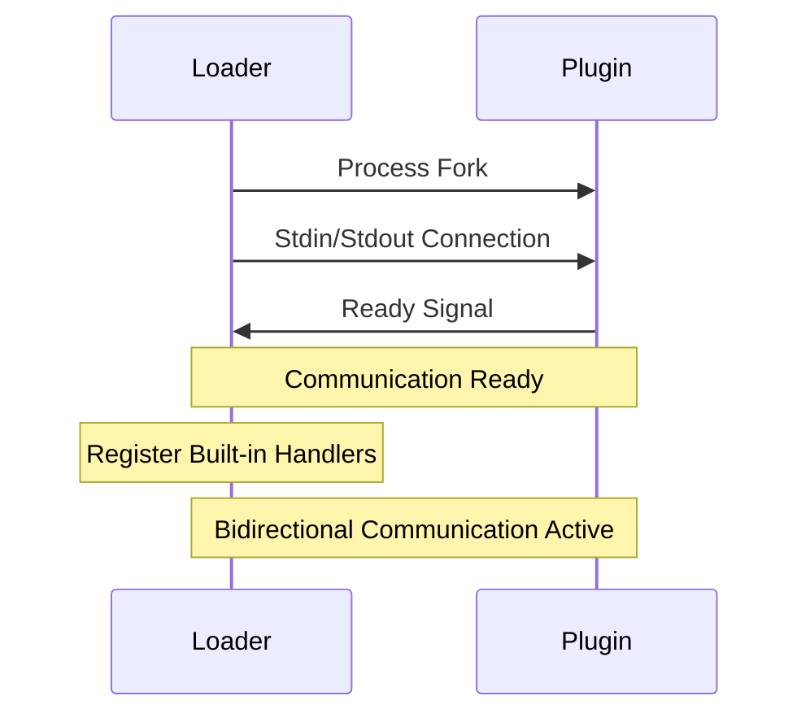
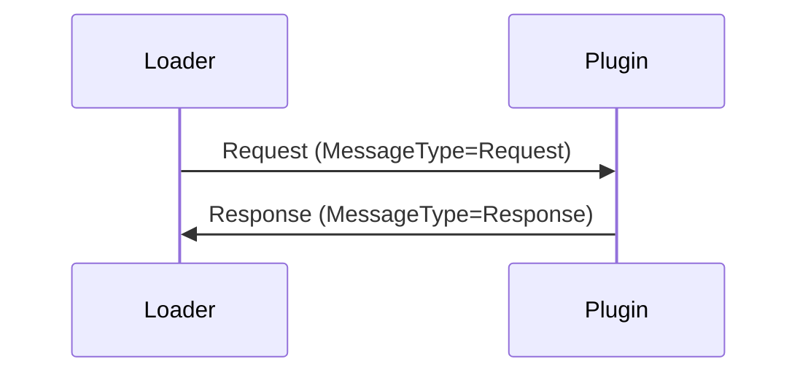
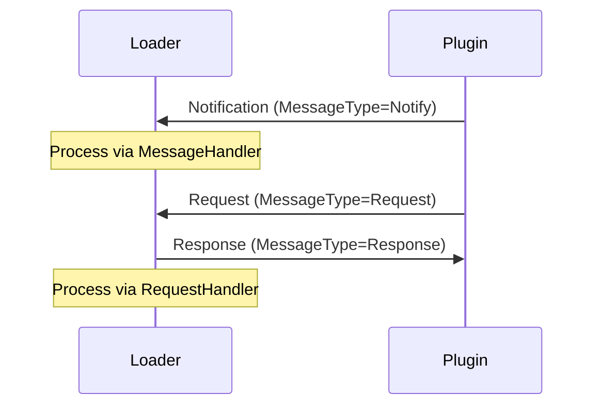
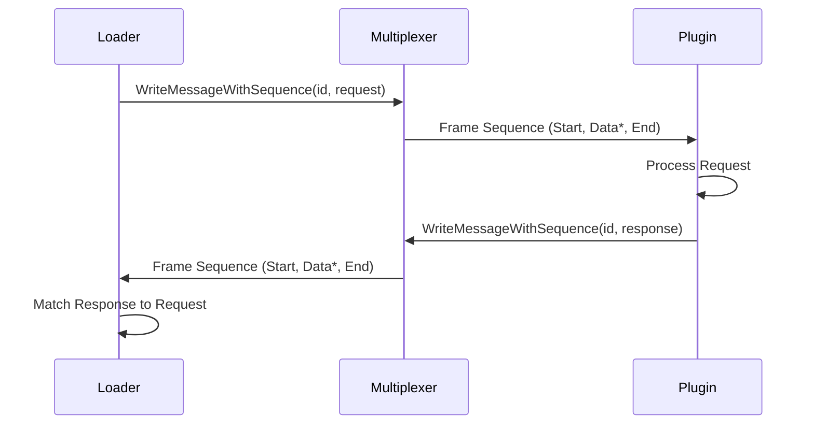
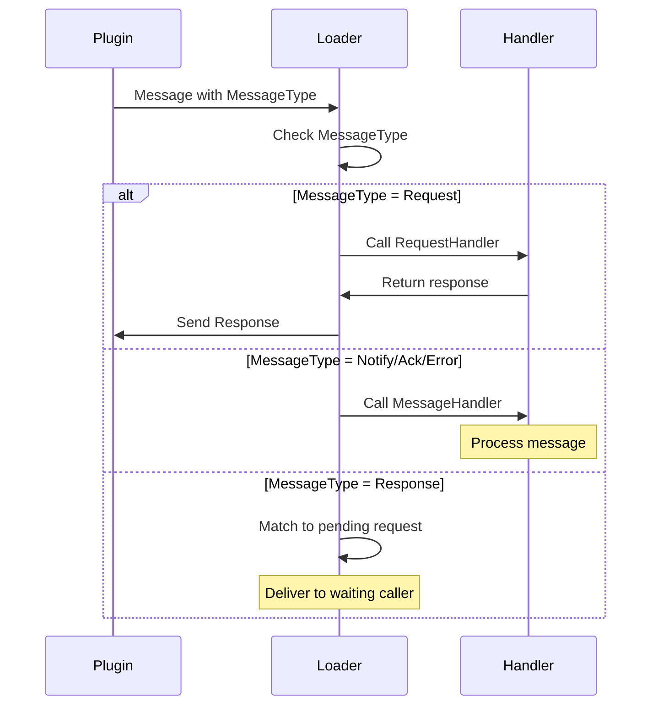

# Plugin.go Communication Protocol Documentation

## Overview

This document defines the communication protocol between the Host Application (Loader) and Plugin Process (Module) in the plugin.go project. Communication occurs through stdin/stdout, using a multiplexer to frame messages and support concurrent request/response cycles.

## Architecture Components

### 1. Loader (Host Application)
- Plugin process lifecycle management
- Request transmission through multiplexer
- Response reception and matching

### 2. Module (Plugin Process)
- Incoming request reception and processing
- Request routing to registered handlers
- Response generation and transmission

### 3. Multiplexer
- Message framing and sequence management
- Concurrent request/response support
- stdin/stdout-based bidirectional communication

## Multiplexer Message Structure

### Message Header (9 bytes)

| Field | Size | Description |
|-------|------|-------------|
| Message Type | 1 byte | Message type identifier |
| Frame ID | 4 bytes | Message sequence identifier (BigEndian uint32) |
| Data Length | 4 bytes | Payload length (BigEndian uint32) |

### Message Types

```go
const (
    MessageHeaderTypeStart    = 0x01  // New message sequence start
    MessageHeaderTypeEnd      = 0x02  // Message sequence termination
    MessageHeaderTypeData     = 0x03  // Message data chunk
    MessageHeaderTypeError    = 0x04  // Multiplexer internal error
    MessageHeaderTypeComplete = 0x05  // Complete message assembly finished
    MessageHeaderTypeAbort    = 0x06  // Message sequence abort
)
```

### Payload Structure

Message payload is composed as follows:

1. **Application Header (plugin.Header)**
2. **User Data** (actual request/response data)

## Plugin Header Structure

### Binary Format

```go
type MessageType uint8

const (
    MessageTypeRequest    MessageType = 0x01 // Request message (expects response)
    MessageTypeResponse   MessageType = 0x02 // Response message (response to request)
    MessageTypeNotify     MessageType = 0x03 // Notification message (no response expected)
    MessageTypeAck        MessageType = 0x04 // Acknowledgment message
    MessageTypeError      MessageType = 0x05 // Error message
)

type Header struct {
    Name        string      // Service name
    IsError     bool        // Error flag
    MessageType MessageType // Message type (Request/Response/Notify/Ack/Error)
    Payload     []byte      // Actual data payload
}
```

### Serialization Format

| Field | Size | Description |
|-------|------|-------------|
| Name Length | 4 bytes | Service name length (BigEndian uint32) |
| Name | Variable | Service name (UTF-8 string) |
| IsError | 1 byte | Error flag (0=success, 1=error) |
| MessageType | 1 byte | Message type (0x01=Request, 0x02=Response, 0x03=Notify, 0x04=Ack, 0x05=Error) |
| Payload Length | 4 bytes | Payload length (BigEndian uint32) |
| Payload | Variable | Actual data |

## Communication Flow

### 1. Initialization Process



#### Ready Signal
```go
Header{
    Name:        "ready",
    MessageType: MessageTypeNotify,
    IsError:     false,
    Payload:     []byte("ready"),
}
```

### 2. Bidirectional Communication Patterns

#### Traditional Request/Response (Loader → Plugin)


#### Plugin-Initiated Messages (Plugin → Loader)


#### Built-in Protocol Messages
The system automatically handles standard protocol messages:
- **info**: Informational messages from plugins
- **warning**: Warning messages from plugins  
- **error**: Error notifications from plugins
- **heartbeat**: Periodic status messages from plugins
- **status**: Plugin status updates

#### Ready Signal
```go
Header{
    Name:    "ready",
    IsError: false,
    Payload: []byte("ready"),
}
```

### 2. Request/Response Cycle



### 3. Message Framing Example

**Request Transmission:**
```
Frame 1: [Type=Start, ID=123, Length=0] + []
Frame 2: [Type=Data, ID=123, Length=X] + [Header + UserData chunk1]
Frame 3: [Type=Data, ID=123, Length=Y] + [UserData chunk2]
Frame N: [Type=End, ID=123, Length=0] + []
```

## Special Message Types

### 1. Bidirectional Communication APIs

#### Loader-Side Handler Registration
```go
// Message Handler Interface
type MessageHandler interface {
    Handle(ctx context.Context, header Header) error
}

// Request Handler Interface  
type RequestHandler interface {
    HandleRequest(ctx context.Context, header Header) (responsePayload []byte, isError bool, err error)
}

// Registration Methods
loader.RegisterMessageHandler(name string, handler MessageHandler)
loader.RegisterMessageHandlerFunc(name string, handler func(ctx context.Context, header Header) error)
loader.RegisterRequestHandler(name string, handler RequestHandler)  
loader.RegisterRequestHandlerFunc(name string, handler func(ctx context.Context, header Header) ([]byte, bool, error))
```

#### Plugin-Side Message Sending
```go
// Send notification message (no response expected)
module.SendMessage(ctx context.Context, serviceName string, payload []byte) error

// Send request message (expects response)
module.SendRequest(serviceName string, payload []byte) ([]byte, error)

// Send message with custom sequence ID
module.SendMessageWithSequence(ctx context.Context, serviceName string, sequenceID uint32, payload []byte) error
```

### 2. Built-in Protocol Messages

The loader automatically registers handlers for standard protocol messages:

```go
// Built-in message handlers (auto-registered)
- "info":      Log informational messages from plugins
- "warning":   Log warning messages from plugins  
- "error":     Log error messages from plugins
- "heartbeat": Handle periodic heartbeat messages
- "status":    Handle plugin status updates
```

#### Example Plugin-to-Loader Messages
```go
// Heartbeat message
Header{
    Name:        "heartbeat",
    MessageType: MessageTypeNotify,
    IsError:     false,
    Payload:     []byte(`{"count":1,"status":"active","timestamp":"15:04:05"}`),
}

// Status update message
Header{
    Name:        "status", 
    MessageType: MessageTypeNotify,
    IsError:     false,
    Payload:     []byte(`{"component":"worker","status":"busy","progress":75}`),
}

// Information message
Header{
    Name:        "info",
    MessageType: MessageTypeNotify, 
    IsError:     false,
    Payload:     []byte("Plugin initialization completed successfully"),
}
```

### 3. Message Routing Logic

The loader uses MessageType to determine how to process incoming messages:

```go
switch header.MessageType {
case MessageTypeResponse:
    // Route to pending request handler
    // Match by sequence ID and deliver response
    
case MessageTypeRequest:
    // Route to registered RequestHandler
    // Generate response and send back
    
case MessageTypeNotify, MessageTypeAck, MessageTypeError:
    // Route to registered MessageHandler
    // Process message (no response expected)
}
```

#### Message Processing Flow


### 4. Shutdown Related Messages

#### Graceful Shutdown
```go
// Loader -> Plugin
Header{
    Name:    "shutdown",
    IsError: false,
    Payload: []byte("graceful shutdown request"),
}

// Plugin -> Loader (response)
Header{
    Name:    "shutdown_ack",
    IsError: false,
    Payload: []byte("graceful shutdown started, waiting for jobs to complete"),
}
```

#### Force Shutdown
```go
// Loader -> Plugin
Header{
    Name:    "force_shutdown",
    IsError: false,
    Payload: []byte("force shutdown request"),
}

// Plugin -> Loader (response)
Header{
    Name:    "force_shutdown_ack",
    IsError: false,
    Payload: []byte("force shutting down"),
}
```

### 2. Ready Request Message

```go
// Loader -> Plugin
Header{
    Name:    "request_ready",
    IsError: false,
    Payload: []byte("please send ready signal"),
}

// Plugin -> Loader (response)
Header{
    Name:    "request_ready_ack",
    IsError: false,
    Payload: []byte("ready signal sent in response to request"),
}
```

## Error Handling

### 1. Transport Errors
- Pipe disconnection, process termination, etc.
- Handled by Multiplexer as MessageHeaderTypeError

### 2. Protocol Errors
- Invalid header format
- Unknown Frame ID
- Message size exceeded

### 3. Application Errors
```go
// Error response example
Header{
    Name:    "service_name",
    IsError: true,
    Payload: []byte("error message"),
}
```

## Serialization Adapters

### JSON Adapter
```go
// Request serialization
func MarshalRequest(req RequestType) ([]byte, error) {
    return json.Marshal(req)
}

// Response deserialization
func UnmarshalResponse(data []byte) (ResponseType, error) {
    var resp ResponseType
    err := json.Unmarshal(data, &resp)
    return resp, err
}
```

### Protobuf Adapter
```go
// Request serialization
func MarshalRequest(req proto.Message) ([]byte, error) {
    return proto.Marshal(req)
}

// Response deserialization
func UnmarshalResponse(data []byte, factory func() ResponseType) (ResponseType, error) {
    instance := factory()
    err := proto.Unmarshal(data, instance)
    return instance, err
}
```

## Performance Considerations

### 1. Message Chunking
- Large messages are split into multiple Data frames
- Default chunk size: 1024 bytes
- Maximum message size: 10MB

### 2. Concurrency
- Multiplexing through Frame ID
- ID management for request/response matching
- Goroutine-based asynchronous processing

### 3. Memory Management
- Read buffer pooling
- Incremental message assembly
- Maximum message size limits

## Security Considerations

### 1. Resource Limits
- Maximum message size (10MB)
- Concurrent request count limits
- Timeout settings

### 2. Input Validation
- Header field validation
- Payload size verification
- Only known service names allowed

## Extensibility

### 1. Adding New Serialization Formats
1. Implement Serializer interface
2. Provide MarshalRequest/UnmarshalResponse functions
3. Use in LoaderAdapter/HandlerAdapter

### 2. Adding New Message Types
1. Define message type constants
2. Add processing logic in Multiplexer
3. Implement handling in upper layers

### 3. Extending Bidirectional Communication

#### Custom Message Handlers
```go
// Register custom message handler on loader side
loader.RegisterMessageHandlerFunc("custom_event", func(ctx context.Context, header plugin.Header) error {
    // Process custom event from plugin
    var event CustomEvent
    json.Unmarshal(header.Payload, &event)
    
    // Handle the event
    return processCustomEvent(event)
})
```

#### Custom Request Handlers
```go
// Register custom request handler on loader side
loader.RegisterRequestHandlerFunc("data_query", func(ctx context.Context, header plugin.Header) ([]byte, bool, error) {
    var query DataQuery
    json.Unmarshal(header.Payload, &query)
    
    // Process query and return data
    result := processDataQuery(query)
    response, err := json.Marshal(result)
    return response, false, err
})
```

#### Plugin-Side Integration
```go
// In plugin, send custom events
event := CustomEvent{Type: "user_action", Data: actionData}
eventData, _ := json.Marshal(event)
module.SendMessage(ctx, "custom_event", eventData)

// In plugin, make custom requests
query := DataQuery{Table: "users", Filter: "active=true"}
queryData, _ := json.Marshal(query)
response, err := module.SendRequest("data_query", queryData)
```

### 4. Advanced Adapter Patterns

#### Type-Safe Bidirectional Adapters
```go
// JSON-based message sender adapter
messageSender := plugin.NewJSONLoaderMessageSender[NotificationData](loader, "notification")
messageSender.Send(ctx, notificationData)

// JSON-based request sender adapter  
requestSender := plugin.NewJSONLoaderRequestSender[QueryRequest, QueryResponse](loader, "query")
response, err := requestSender.SendRequest(ctx, queryRequest)

// JSON-based message handler adapter
messageHandler := plugin.NewJSONLoaderMessageHandlerAdapter[EventData](
    loader, "event",
    func(ctx context.Context, event EventData) error {
        return processEvent(event)
    },
)
defer messageHandler.Unregister()
```

## Implementation Notes

### MessageType Routing Implementation
The loader's message processing logic routes messages based on MessageType:

```go
func (l *Loader) handleMessages() {
    for {
        select {
        case msg := <-messageChannel:
            var header Header
            header.UnmarshalBinary(msg.Data)
            
            switch header.MessageType {
            case MessageTypeResponse:
                l.handleResponse(msg.ID, header)
            case MessageTypeRequest:
                l.handleRequest(header)
            case MessageTypeNotify, MessageTypeAck, MessageTypeError:
                l.handleMessage(header)
            }
        }
    }
}
```

### Built-in Handler Registration
Built-in handlers are automatically registered during loader creation:

```go
func (l *Loader) registerBuiltinHandlers() {
    l.RegisterMessageHandlerFunc("info", l.handleInfoMessage)
    l.RegisterMessageHandlerFunc("warning", l.handleWarningMessage)
    l.RegisterMessageHandlerFunc("error", l.handleErrorMessage)
    l.RegisterMessageHandlerFunc("heartbeat", l.handleHeartbeatMessage)
    l.RegisterMessageHandlerFunc("status", l.handleStatusMessage)
}
```

This protocol documentation comprehensively covers all communication aspects of the plugin.go system, including the new bidirectional communication features, providing detailed information for developers to understand and extend the system.